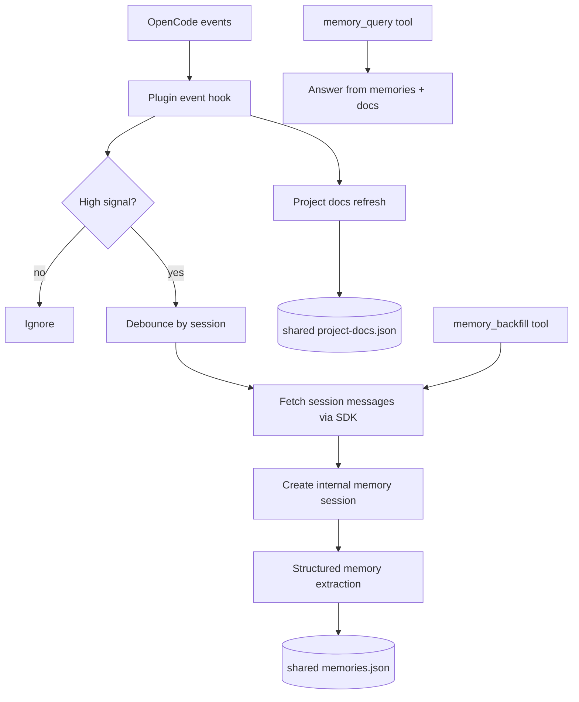

## Goal

The Gemini always-on memory example keeps a persistent memory process running beside the agent. This
package turns that into an **installable OpenCode plugin** that users can enable directly from npm.

## What the package now does

| Capability | Implementation in `opencode-memory-agent` |
| --- | --- |
| Install from plugin config | npm package export from `plugin/index.js` |
| Memory ingest | Debounced processing of OpenCode session events |
| Memory store | `.opencode/memory/shared/memories.json` |
| Project-doc support | `.opencode/memory/shared/project-docs.json` |
| Backlog processing | `memory_backfill` custom tool and optional startup backfill |
| Status visibility | `memory_status`, `client.app.log()`, toast notifications, `status.json` |
| Secret protection | `.env` read guard + redaction-focused prompts |

## Runtime architecture



## Why this reproduces the Gemini example

The Gemini example had three major loops:

1. **ingest new information**,
2. **consolidate it into durable memory**, and
3. **query it later**.

This plugin reproduces those loops with OpenCode-native primitives:

- **ingest**: watch `session.idle`, `message.updated`, `todo.updated`, and selected doc edits,
- **consolidate**: transform recent session transcripts into durable memory entries,
- **query**: answer over the stored memories and indexed project docs.

## Storage layout

```text
.opencode/memory/
  shared/
    memories.json
    project-docs.json
  private/
    state.json
    status.json
```

- `shared/` is safe for curated, redacted memory that can move with the project.
- `private/` tracks processing state and health signals that should typically stay local.

## Back-processing existing data

For existing repositories with long OpenCode history, use the `memory_backfill` tool. The plugin
lists prior sessions through the SDK, skips already-processed sessions with the same content hash,
and ingests only changed or new sessions.

## Project docs support

Project docs are indexed separately from session memory so that `memory_query` can answer using both:

- durable conversation memory,
- current project documentation.

This mirrors the Gemini example's persistent knowledge layer without requiring users to upload docs
manually into a separate system.
