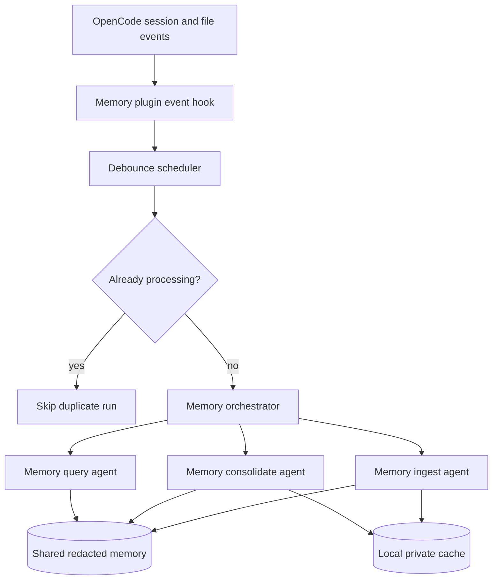

## Goal

The reference implementation in GoogleCloudPlatform's `always-on-memory-agent` uses Gemini + ADK to:

1. ingest new information,
2. consolidate it in the background, and
3. answer queries from a persistent memory store.

This repository reframes that idea around **OpenCode plugins, OpenCode agents, and the OpenCode SDK**.

## Recommended OpenCode equivalent

| Gemini/ADK concept | OpenCode equivalent |
| --- | --- |
| ADK orchestrator | A `memory-orchestrator` subagent plus a lightweight plugin scheduler |
| IngestAgent | `memory-ingest` subagent |
| ConsolidateAgent | `memory-consolidate` subagent |
| QueryAgent | `memory-query` subagent |
| Timer/file watcher loop | Plugin `event` hook + debounced scheduling |
| Console logging | `client.app.log()` |
| Python background process | Guarded Bun subprocess or SDK-driven session work |
| SQLite-only storage | Shared redacted project memory + local private state |

## Architecture

## Event strategy

OpenCode plugins can subscribe to documented event types such as `session.idle`, `file.edited`,
`message.updated`, and `todo.updated`. For a memory agent, the safest starting point is:

- trigger on **`session.idle`** after useful work completes,
- optionally observe **`file.edited`** and **`todo.updated`** as hints,
- debounce all triggers per session or project,
- skip new work while an existing memory pass is still active.

This reduces churn and avoids the "always-on" process becoming an aggressive second agent.

## Background work without recursive subagents

A memory plugin should avoid recursively spawning more OpenCode subagents every time a subagent
already runs. The template in `examples/project-template/.opencode/plugins/memory-agent.js`
therefore follows these rules:

1. schedule work only on high-signal events,
2. keep one in-flight memory pass per session,
3. log the request first,
4. only then hand off to either:
   - the current OpenCode SDK client, or
   - a guarded Bun subprocess with a minimal environment.

A guarded subprocess should:

- inherit only the environment variables it really needs,
- never read `.env` directly,
- avoid shell-string concatenation,
- carry a marker environment variable like `OPENCODE_MEMORY_AGENT_CHILD=1` so the plugin can
  refuse to schedule nested memory runs.

## Agent layout

The example project template defines four agents:

- `memory-orchestrator`: receives the task and decides which specialist to call,
- `memory-ingest`: turns fresh context into structured facts,
- `memory-consolidate`: merges related facts and prunes low-value duplicates,
- `memory-query`: answers questions over the curated memory set.

This mirrors the Gemini reference while keeping the work native to OpenCode's own agent model.

## Logging

OpenCode explicitly documents `client.app.log()` for structured plugin logging. Prefer it over
`console.log()` so logs can be routed and filtered consistently during local development and CI.

## Storage recommendation

For teams working across multiple machines, use a split store:

- **Shared project memory**: redacted markdown or JSON files committed intentionally.
- **Local private state**: ignored cache files for raw captures, transient indexes, or provider
  responses.

That gives you portability without forcing secrets or noisy raw traces into Git.
