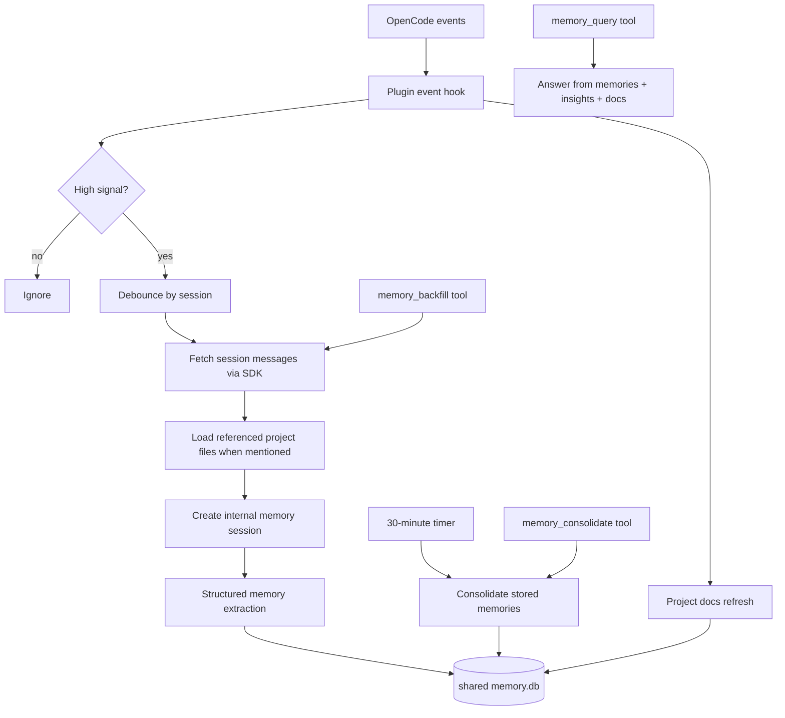

## Goal

`opencode-memory-agent` is an installable OpenCode plugin for persistent session memory,
cross-session insights, project-doc indexing, and status visibility.

## Capabilities

| Capability | Implementation in `opencode-memory-agent` |
| --- | --- |
| Install from plugin config | npm package export from `plugin/index.js` |
| Memory ingest | Debounced processing of OpenCode session events plus referenced-file loading for local text/code files mentioned in the session |
| Periodic consolidation | Default 30-minute consolidation timer plus `memory_consolidate` |
| Shared store | `.opencode/memory/shared/memory.db` |
| Review artifacts | `.opencode/memory/shared/memories.json`, `.opencode/memory/shared/insights.json`, `.opencode/memory/shared/project-docs.json` |
| Project-doc support | Indexed into the shared database and mirrored to `project-docs.json` |
| Backlog processing | `memory_backfill` custom tool and optional startup backfill |
| Status visibility | `memory_status`, `client.app.log()`, toast notifications, `status.json` |
| Secret protection | `.env` read guard + redaction-focused prompts |

## Runtime architecture



For the reference Gemini architecture and OpenCode-specific differences, see
[`Gemini Reference Architecture`](/reference/gemini-to-opencode-equivalents/).

## Storage layout

```text
.opencode/memory/
  shared/
    memory.db
    memories.json
    insights.json
    project-docs.json
  private/
    state.json
    status.json
```

- `shared/` stores the primary SQLite memory database plus mirrored JSON artifacts that can move with the project.
- `private/` tracks processing state and health signals that should typically stay local.

## Back-processing existing data

For existing repositories with long OpenCode history, use the `memory_backfill` tool. The plugin
lists prior sessions through the SDK, skips already-processed sessions with the same content hash,
and ingests only changed or new sessions.

## Project docs support

Project docs are indexed separately from session memory so that `memory_query` can answer using all three:

- durable conversation memory,
- consolidated cross-memory insights,
- current project documentation.

When the session transcript mentions readable local project files such as `README.md` or source
files under the repository, the ingest path also loads small excerpts from those files and includes
them in the memory extraction step.
