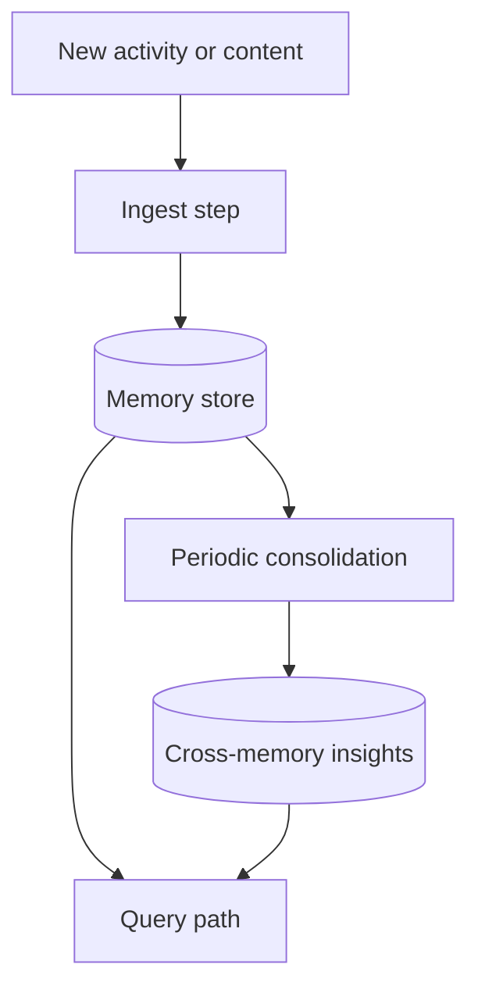

## Overview

The Gemini reference project is an always-on memory system with three main responsibilities:

1. ingest new information,
2. consolidate stored memories on a cadence,
3. answer later queries from the accumulated memory.

`opencode-memory-agent` keeps that same high-level shape, but it runs as an installable OpenCode
plugin instead of a standalone background service.

## Architecture map

| Gemini reference concept | `opencode-memory-agent` equivalent |
| --- | --- |
| ADK agent orchestration | Installable OpenCode plugin with internal SDK sessions |
| Gemini model calls | OpenCode-configured provider/model used by the plugin's internal prompts |
| Python app loop | Plugin event hooks and timers inside the OpenCode runtime |
| Direct process logging | `client.app.log()` |
| File watcher inbox | OpenCode session events plus optional project-doc refresh on edits |
| HTTP query endpoint | `memory_query` custom tool backed by stored memory + indexed docs |
| Consolidation job | `consolidateEveryMinutes` timer and `memory_consolidate` tool |
| Single memory store | `.opencode/memory/shared/*.json` + `.opencode/memory/private/*.json` |

## Reference architecture

In this repository, those same responsibilities are implemented with OpenCode-native pieces:

- session and file events trigger memory ingestion,
- stored memories are consolidated on a configurable timer,
- queries combine memory entries, consolidated insights, and indexed project docs.

## Differences that matter

The main runtime differences are:

- **Runtime model**: the Gemini reference runs as a standalone process; this plugin runs only while OpenCode is running.
- **Ingest source**: the Gemini reference watches its own inputs; this plugin uses OpenCode events and optional backfill.
- **Catch-up behavior**: this plugin relies on `memory_backfill` and optional startup processing to recover work that happened while OpenCode was closed.
- **Storage format**: this plugin stores curated JSON artifacts in `.opencode/memory/` rather than a separate database format.

## Where to look elsewhere in the docs

- For installation and verification, see the install guide.
- For the plugin's own runtime flow and storage layout, see the runtime architecture guide.
