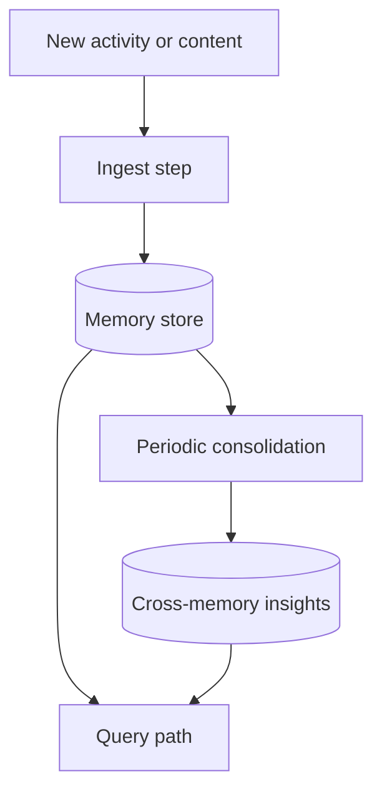

## Overview

The Gemini reference project is an always-on memory system with three main responsibilities:

1. ingest new information,
2. consolidate stored memories on a cadence,
3. answer later queries from the accumulated memory.

`opencode-memory-agent` keeps that same high-level shape, but it runs as an installable OpenCode
plugin instead of a standalone background service.

## Architecture map

| Gemini reference concept | `opencode-memory-agent` equivalent |
| --- | --- |
| ADK agent orchestration | Installable OpenCode plugin with internal SDK sessions |
| Gemini model calls | OpenCode-configured provider/model used by the plugin's internal prompts |
| Python app loop | Plugin event hooks and timers inside the OpenCode runtime |
| Direct process logging | `client.app.log()` |
| File watcher inbox | OpenCode session events, indexed docs, and referenced-file loading from session transcripts |
| HTTP query endpoint | `memory_query` custom tool backed by SQLite-stored memory + indexed docs |
| Consolidation job | `consolidateEveryMinutes` timer and `memory_consolidate` tool |
| Single memory store | `.opencode/memory/shared/memory.db` with mirrored JSON review artifacts |

## Reference architecture

In this repository, those same responsibilities are implemented with OpenCode-native pieces:

- session and file events trigger memory ingestion,
- stored memories are consolidated on a configurable timer,
- queries synthesize from stored memories, consolidation insights, and indexed project docs.

## Verified storage and retrieval behavior in the Gemini reference

The reference README explicitly states:

- it uses **SQLite** as its persistent memory store (`memory.db`),
- it uses **no vector database** and **no embeddings**,
- it has a **processed file** table to avoid re-ingesting the same inbox file,
- the QueryAgent reads stored memories plus consolidation history directly from the database.

It also ingests more file types than this plugin does. The reference accepts text, images, audio,
video, and PDFs through an inbox watcher, dashboard uploads, or an HTTP API.

## Current plugin alignment

This plugin now matches the key storage decision from the Gemini reference:

- shared memories, insights, and indexed docs are stored in `.opencode/memory/shared/memory.db`,
- `memories.json`, `insights.json`, and `project-docs.json` are mirrored review artifacts for users,
- retrieval uses direct reads from the shared database rather than a vector index,
- when a session transcript references local project files, the plugin loads small readable file excerpts and includes them in memory extraction.

For query-time selection, the plugin narrows the SQLite-backed records with lightweight token-overlap
ranking before the QueryAgent synthesizes the final answer. This keeps retrieval question-aware
without adding an embedding pipeline the Gemini reference does not use.

## Differences that matter

The main runtime differences are:

- **Runtime model**: the Gemini reference runs as a standalone process; this plugin runs only while OpenCode is running.
- **Ingest source**: the Gemini reference watches an inbox folder and HTTP/dashboard inputs; this plugin uses OpenCode events, optional backfill, indexed docs, and referenced-file loading from transcripts.
- **Catch-up behavior**: this plugin relies on `memory_backfill` and optional startup processing to recover work that happened while OpenCode was closed.
- **File modality**: the Gemini reference ingests multimodal files; this plugin currently loads readable local text/code/config files and separately indexes configured docs.
- **OpenCode internals**: this plugin uses OpenCode's documented SDK/session APIs and repository files; it does not directly query an internal OpenCode database.

## Where to look elsewhere in the docs

- For installation and verification, see the install guide.
- For the plugin's own runtime flow and storage layout, see the runtime architecture guide.
